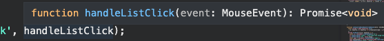

## 파라미터 타입들 정의하기

parameter, return value등에 대해 따로 빼서 interface나 type으로 정의해서 사용하면 된다.

## Event type

```jsx
function initEvents() {
  list.addEventListener('click', handleListClick);
}

async function handleListClick(event: any) {
 // ...
}
```

에서 click 이벤트이므로 MouseEvent로 바꿀 수 있다.

```jsx
async function handleListClick(event: MouseEvent) {
 // ...
}
```

이벤트 타입은 event위에 마우스를 올리면 알 수 있다.



## Axios

Promise를 리턴하는 함수는 Promise<AxiosResponse<< **Type** >> 으로 정의해주면 된다.

------


> [TS강의](https://www.inflearn.com/course/%ED%83%80%EC%9E%85%EC%8A%A4%ED%81%AC%EB%A6%BD%ED%8A%B8-%EC%8B%A4%EC%A0%84/dashboard)를 들으며 정리한 내용입니다.
