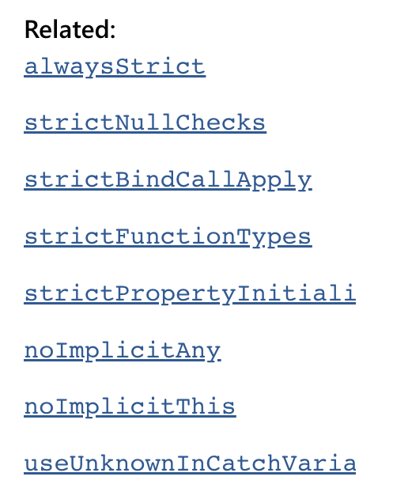
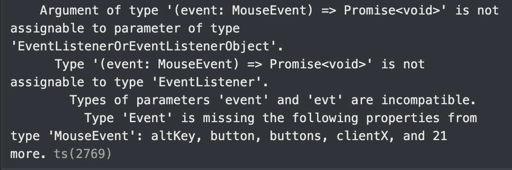

# Prerequisite

tsconfig.json
```ts
"strict": true
```

{: w="300" h="400"}
요런 family option들 모두에 대해 강한 타입 체크를 해주는 옵션이다.

# 1. Null 타입 오류 및 함수 타입 오류 해결

## Strict Null Check

```jsx
function initEvents() {
  rankList.addEventListener('click', handleListClick);
}
```

rankList에 대한 null check가 필요하다. 따라서 initEvents 함수 최상단에 다음과 같은 Null check를 넣어줌으로써 해결한다.

```jsx
 if (!rankList) {
    return;
  }
```

## Strict Function Type Check

function의 argument type에 대해서도 정확하게 맞춰주어야 한다. 물론 tsconfig.json에서 ‘strictFunctionTypes:false’를 하며 에러가 사라지긴 한다.

예를 들어 handleClick이란 함수가 있고, 이걸 something에 addEventListener로 추가하려고 할 때  오류가 발생한다. 

```jsx
//...
	something.addEventListener('click', handleClick)
//...

async function handleClick(event: MouseEvent) {
	//...
}
```

에러 메시지를 차근차근 읽어보면 맨 끝에 이런 문구를 확인할 수 있는데



event의 Type이 MouseClick인데 addEventListener의 콜백의 파라미터 타입이랑 호환이 불가능해서 그렇단다. 그러니까 타입을 MouseEvent → Event로 바꿔주면 된다.

여기서 얻은 교훈. 구글링을 잘 하기 전에 에러 메세지를 잘 확인하자. 구글링의 질을 높일 수 있다.

# 2. **타입스크립트 내장 타입의 위계 구조 설명 및 타입 오류 해결**

# 3. 타입 단언을 이용한 타입 에러 해결

### 타입 단언 시 주의점!

# 옵셔널 체이닝 연산자

# DOM 유틸 함수 활용성을 높이는 타입 정의

------
reference.

[https://www.typescriptlang.org/tsconfig#strict](https://www.typescriptlang.org/tsconfig#strict)

> [TS강의](https://www.inflearn.com/course/%ED%83%80%EC%9E%85%EC%8A%A4%ED%81%AC%EB%A6%BD%ED%8A%B8-%EC%8B%A4%EC%A0%84/dashboard)를 들으며 정리한 내용입니다.
